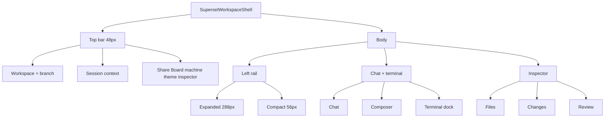

# Gen 2 Superset Workspace UI Design Contract

> **Status:** Design contract (audit of the current working tree). Top bar, rail empty states, and inspector tabs updated 2026-10-08; composer, agent actions, terminal tabs and Browser tab added 2026-10-10.  
> **Target:** `/gen2/[workspaceId]/superset`  
> **Governing standards:** `AGENTS.md`, `docs/design/workspace-controls.md`, shadcn/ui  
> **Do not change product behavior.** Branch selection, worktree selection, sharing, Git, and agent runs keep their current meaning.

This document is the visual implementation contract. Another contributor should be able to restyle the shell from it without inventing a new direction. Findings below separate **observed rendered problems** from **code-based risks**.

---

## 0. Audit method and access limits

**Preview used:** `http://127.0.0.1:3000` (`next dev` in `apps/web`). The inspected workspace was already authenticated. A later pass measured the same page after the shell polish.

**Viewports measured with DevTools device metrics** (same authenticated page):

The first measured pass, before pixel rail caps, is historical: a ~2995px window gave a 599px sidebar and an 838px inspector because panel sizes were percentages. Current caps are in the table in section 1.

**Surfaces reviewed**

| Surface                                                    | Status                                                                                                                                                                                              |
| ---------------------------------------------------------- | --------------------------------------------------------------------------------------------------------------------------------------------------------------------------------------------------- |
| Empty chat                                                 | Observed. Heading “What should we build?”, composer, three suggestion cards, Codex send control. Sidebar: “No AI providers connected.”                                                              |
| Populated chat (user/assistant turns, markdown, streaming) | **Not accessed.** No connected provider; thread empty. Do not invent transcript chrome.                                                                                                             |
| Tool activity timeline                                     | **Not accessed.** Requires a running or completed agent turn.                                                                                                                                       |
| File editor                                                | Observed empty/loading: “Loading files…”, “Select a file to open it.” No file was opened; CodeMirror syntax on a real buffer was not inspected in this pass.                                        |
| Terminal                                                   | Observed collapsed dock (36px bar: Terminal, branch chip, Expand). Expanded xterm session **not opened** (would attach to the guest).                                                               |
| Changes / Review                                           | Observed only as hidden tab panels in the accessibility tree: “Working tree is clean” / “This branch has nothing to review yet.” Diff rows were not rendered.                                       |
| Branch / worktree menu                                     | Trigger observed in the top bar and sidebar. Open menu **not captured** in this pass.                                                                                                               |
| Sharing dialog                                             | Share control observed. Dialog **not opened** in this pass. Specify from `workspace-share-dialog.tsx` + `WorkspaceButton` contract, and verify after implementation.                                |
| Workspaces Board                                           | Control observed (`aria-pressed`). Board canvas **not opened** in this pass. Code uses a horizontal flex of five columns with `min-w-[260px]` and `overflow-x-auto`.                                |
| Light theme                                                | Theme toggle present. A later pass set `data-theme="light"` and measured cream `#f2e9d6` with navy text. Light secondary is `#465c91` inside this shell so 12px copy stays at least 4.5:1 on cream. |

---

## 1. Executive summary

The shell is already a quiet dark IDE: 48px top bar, left worktree/chat rail, center agent chat, right Files/Changes/Review inspector, bottom terminal dock. Top-bar **horizontal overflow is no longer the binding bug** at 768 and 390 (`scrollWidth === clientWidth`).

Verified layout after the polish pass (device metrics, dark unless noted):

| Viewport | Sidebar                | Chat  | Inspector | Notes                                                                                                |
| -------- | ---------------------- | ----- | --------- | ---------------------------------------------------------------------------------------------------- |
| 1440×900 | 288px                  | 750px | 400px     | No top-bar overflow. Light theme checked at this size.                                               |
| 1024×768 | 288px (still expanded) | 334px | 400px     | Session card hidden. Suggestions stack to one column. Sidebar did not auto-collapse in this browser. |

Rails use pixel caps (`288px` sidebar, `400px` inspector, `preserve-pixel-size`) so a wide window does not stretch them. Auto-collapse still runs from `matchMedia` in `useLayoutEffect`, plus a `ResizeObserver`, and is covered by the shell unit test. In this embedded browser the client effect did not stay attached (machine status remained “Checking…”, and `window` had no resize listener), so 1024px still showed both rails and a 334px chat. Do not treat that screenshot as proof that collapse works for a normal browser session.

Remaining gaps:

1. **Auto-collapse is implemented and unit-tested, and still needs a real window drag.** Device emulation here did not run the client effect, so 1024×768 kept both rails and a 334px chat. Suggestion cards correctly stack once the chat pane is under 640px.
2. **Chat rows are one 36px line.** Meta sits inline. Inspector tabs stay raw `role="tab"` buttons at 32px, which this contract allows.
3. **Context is still repeated** across the workspace name, branch pill, session card, and rail. Chat and the file inspector stay the large surfaces. The session card hides at ≤1279px.

---

## 1.1 Observed rendered problems

| Area             | Viewport                           | Observed defect                                                         | Evidence                                                                                                                                                                              |
| ---------------- | ---------------------------------- | ----------------------------------------------------------------------- | ------------------------------------------------------------------------------------------------------------------------------------------------------------------------------------- |
| Center squeeze   | 768×900, 390×844                   | Chat stage 398px / 202px while sidebar + inspector remain open          | At 390, New Chat clips to “+ No”; Files tab label is truncated; suggestion cards become a 1-column stack inside ~200px.                                                               |
| Sidebar density  | 390×844                            | Expanded rail used as a full column instead of a 56px icon rail         | “ACTIVE WORKTREE” wraps; chat meta “0” sits on its own; Connect in Settings wraps to three lines.                                                                                     |
| Metadata stack   | 1024×768 and up                    | Too many peer status objects in the top bar                             | Brand “C”, workspace name, `main` pill, session card (“Initial Workspace Session”), Share, Board, “Machine: Ready”, theme, inspector. None is wrong; together they flatten hierarchy. |
| Empty-chat scale | All                                | Hero is quiet enough; supporting type is slightly small                 | Heading ~18px semibold (good). Suggestion descriptions `text-[11px]`. Composer body is the real content and should stay 14px.                                                         |
| Inspector empty  | All (this workspace)               | Files never left “Loading files…” during the session                    | Empty editor copy “Select a file to open it.” Changes/Review already have clean empty strings in the tree.                                                                            |
| Terminal dock    | All                                | Collapsed bar is usable; Expand/Collapse + branch chip compete for 36px | Observed 36px bar with 12px title, outline badge, muted Expand + chevron. Alignment is close; keep 36px and 12px/11px, do not drop to 10px.                                           |
| Status color     | Machine, branch, and working chips | Use `--ws-status-*`                                                     | Ready, working, and error dots are token colors. Unknown git status stays muted. “Ready” is shown only after the activity check reports connected.                                    |
| Light theme      | 1440×900                           | Cream canvas, navy type                                                 | Primary on cream is about 10:1. Secondary in this shell is `#465c91`, about 5.4:1. Dark secondary `#96918a` on `#070c1a` is about 6.2:1.                                              |

## 1.2 Code-based risks (not claimed as current pixels)

1. **Two workspace palettes.** `globals.css` still defines `--workspace-surface: #121417` and comments that the IDE is “permanently dark.” The live shell binds `--ws-*` to `--brand-paper` / `--brand-ink` (two-theme). Do **not** remap the Superset shell back to `#121417`; that fights `ThemeToggle` and the rest of the app.
2. **Auto-collapse may miss emulation / some resizes.** Layout effect listens to `matchMedia` `change` and `window` `resize`, then re-queries matches. Device emulation in this environment did not collapse rails. Implementation must keep a resize path and be verified with a real window drag.
3. **Bespoke controls remain.** `.gen2-worktree-trigger-btn`, `.gen2-sidebar-chat-card`, and `.gen2-ide-tabs button` are not `WorkspaceButton` / shadcn `Tabs`. `docs/design/workspace-controls.md` already allows specialized tabs/tree rows; still unify height (36px rows, 32px tabs) and hover/selected tokens.
4. **Inspector tabs** are now shadcn `Tabs` (see section 7). Resolved 2026-10-08.
5. **Board columns** are `flex` + `min-w-[260px]` + `overflow-x-auto`, not a 5-column CSS grid. Horizontal scroll is the intended compact behavior; add a visible overflow cue if columns clip without a scrollbar affordance.
6. **Editor theme** uses `var(--ss-background)` / `--brand-*` syntax colors, not a hardcoded `{ dark: true }` canvas. Light-theme editor contrast must be checked after a theme toggle, not assumed from the old cream-vs-dark-syntax report.

---

## 2. Visual direction and rationale

CoDev Superset is a hosted developer workspace. **Chat and code are the main content.** Branch and worktree controls stay visible because they change the guest filesystem the agent, editor, terminal, and Git share.

### Principles

- **One product, two themes.** Use `theme-tokens.css` `--brand-*` via `--ws-*` aliases. Light = paper cream + navy ink + blue accent. Dark = Midnight Blueprint (`#060a17` / `#0d152d` / `#131f42`) + ice ink + Miami blue accent + brushed brass. Toggle through existing `ThemeToggle`.
- **Three surfaces, no glass.** Canvas, panels, and raised controls differ by a small lightness shift and a 1px low-alpha border. No gradients, blurs, or large shadows.
- **One accent.** `--brand-accent` only for primary actions, focus, and the current selection. Status color only for machine/agent/git state.
- **Quiet type.** Geist Sans for UI and chat; Geist Mono for paths, branches, terminal, diffs. No oversized page titles inside the IDE.
- **Existing icon family.** `lucide-react` only.

---

## 3. Shell architecture

Persistent **48px** top bar. Body is three columns. Terminal docks **inside** the center column.

```
+----------------------------------------------------------------------------------+
| TOP BAR 48px  Surface 2                                                          |
| [rail] [C] Workspace  [branch pill]  |  [provider] session title  |  Share Board |
|                                      |                            |  machine  ☀  |
|                                      |                            |  inspector   |
+----------------------------------------------------------------------------------+
| LEFT RAIL Surface 2     | CENTER Surface 1                         | INSPECTOR   |
| 288px / 56px            | min 420px flex                           | 360–440 / 0 |
|                         |                                          |             |
| Worktree trigger 36px   | Chat history (flex, min-width 0)         | Files       |
| + New Chat 36px         | Composer (pinned)                        | Changes     |
| Recent chats 36px rows  | Terminal dock 36px / ~35% height         | Review      |
+----------------------------------------------------------------------------------+
```



---

## 4. Semantic tokens

Bind only inside `.gen2-ide-container`, `.gen2-ide`, `.gen2-workspace-surface`, `.gen2-workspace-button`. Values come from `--brand-*` so light/dark stay in lockstep.

### Surfaces

| Role     | Token                 | Light                            | Dark      | Use                                         |
| -------- | --------------------- | -------------------------------- | --------- | ------------------------------------------- |
| Canvas   | `--ws-surface-1`      | `--brand-paper` `#f2e9d6`        | `#060a17` | Chat stage, editor, terminal body           |
| Panel    | `--ws-surface-2`      | `--brand-paper-bright` `#fffdf7` | `#0d152d` | Top bar, sidebar, inspector, dock bar       |
| Raised   | `--ws-surface-3`      | `--brand-paper-tan` `#e8dcc0`    | `#131f42` | Composer, session card, selected tab, menus |
| Hover    | `--ws-surface-hover`  | 8% ink on surface-2              | same mix  | Rows, ghost buttons                         |
| Selected | `--ws-surface-active` | 14% ink on surface-2             | same mix  | Current chat / branch                       |

### Text

| Role      | Token                 | Light                   | Dark      | Use                             |
| --------- | --------------------- | ----------------------- | --------- | ------------------------------- |
| Primary   | `--ws-text-primary`   | `--brand-ink` `#0e2f7e` | `#f4f6fb` | Chat, titles, inputs            |
| Secondary | `--ws-text-secondary` | `--brand-ink-muted`     | `#8ea3c7` | Meta, inactive tabs, file names |
| Muted     | `--ws-text-muted`     | `--brand-ink-faint`     | `#5c7094` | Placeholders, hints             |
| Inverse   | `--ws-text-inverse`   | `--brand-on-accent`     | `#060a17` | On solid accent                 |

### Borders and accent

| Role        | Token                | Use                                           |
| ----------- | -------------------- | --------------------------------------------- |
| Subtle      | `--ws-border-subtle` | `rgba(ink-rgb, 0.14–0.18)` panel rules        |
| Medium      | `--ws-border-medium` | Composer, cards, menus                        |
| Focus       | `--ws-border-focus`  | `--brand-accent`                              |
| Accent      | `--ws-accent`        | Primary button, brand mark, current indicator |
| Accent soft | `--ws-accent-soft`   | Selected chat wash                            |

### Status (only for real state)

| Role    | Token                 | Meaning                                                               |
| ------- | --------------------- | --------------------------------------------------------------------- |
| Ready   | `--ws-status-ready`   | `--brand-teal` — machine ready, clean tree when **known**             |
| Working | `--ws-status-working` | `--brand-orange` — booting, agent running, uncommitted when **known** |
| Error   | `--ws-status-error`   | `--brand-destructive` — failed command, machine error                 |

Unknown git/machine data stays muted text. Never label unknown as clean or online.

Bridge Tailwind/shadcn on the same subtree: `--color-background` → surface-1, `--color-primary` → accent, `--color-destructive` → error. Do not use `--workspace-surface` (`#121417`) in this shell.

---

## 5. Typography and spacing

**Sans:** Geist Sans, system UI fallback.  
**Mono:** Geist Mono, `ui-monospace` fallback.

| Element                           | Size            | Line height | Weight | Family       |
| --------------------------------- | --------------- | ----------- | ------ | ------------ |
| Session / workspace title         | 14px            | 20px        | 600    | Sans         |
| Section label (sentence case)     | 12px            | 16px        | 600    | Sans         |
| Chat body                         | 14.5px          | 24px        | 400    | Sans         |
| Composer                          | 14px            | 22px        | 400    | Sans         |
| Empty hero                        | 18px            | 24px        | 600    | Sans         |
| Sidebar row title                 | 13px            | 18px        | 500    | Sans         |
| Tabs / rail rows                  | 13px            | 18px        | 500    | Sans         |
| Meta / dock                       | 12px            | 16px        | 400    | Sans         |
| Suggestion supporting             | 12px (not 11px) | 16px        | 400    | Sans         |
| Code / diff                       | 13px            | 20px        | 400    | Mono         |
| Terminal                          | 12px            | 18px        | 400    | Mono         |
| Status chips (the only 11px text) | 11px            | 14px        | 500    | Mono or sans |

**Spacing (4px grid):** 4, 8, 12, 16, 24, 32.

- 4: icon-to-label, chip padding
- 8: toolbar gaps, compact row padding
- 12: sidebar inset, tab padding
- 16: chat block gap, panel padding
- 24: empty-state stack
- 32: composer clearance from dock

---

## 6. Control sizes and radius

Follow `docs/design/workspace-controls.md`. Ordinary actions use `WorkspaceButton`. Call sites own layout classes only.

| Control                                  | Height | Padding | Radius                                                                                      |
| ---------------------------------------- | ------ | ------- | ------------------------------------------------------------------------------------------- |
| Toolbar (Share, Board, theme, inspector) | 32px   | 0 10px  | 6px                                                                                         |
| Icon button                              | 32×32  | 0       | 6px                                                                                         |
| New Chat                                 | 36px   | 0 12px  | 6px, outline (secondary); the composer and connection state lead, not this button           |
| Worktree trigger                         | 36px   | 0 12px  | 6px                                                                                         |
| Chat / branch row                        | 36px   | 0 12px  | 6px — **single line**; meta may sit inline, not a second wrapped block that grows past 36px |
| Inspector tabs (shadcn `Tabs`)           | 32px   | 0 12px  | 6px                                                                                         |
| Inputs                                   | 32px   | 0 10px  | 6px                                                                                         |
| Status chip                              | 20px   | 0 6px   | 4px                                                                                         |
| Dialog / composer                        | —      | —       | 12px                                                                                        |
| Cards / menus                            | —      | —       | 8px                                                                                         |

**Borders are for panel dividers, inputs, and focus.** Interactive chips and secondary buttons (branch pill, worktree trigger, selected tab, New Chat, Share) use a quiet `--ws-surface-3` fill and a transparent border, so they keep their size without an outline. Section labels are sentence case with no count chips; counts that restate what is visible (one branch, a chat total) are omitted.

Focus: 2px `--ws-accent` outline, 1px offset, `:focus-visible` only. Hover: 120ms color, no scale. Disabled: 45% opacity.

---

## 7. Navigation hierarchy

### Top bar (48px)

Implemented in `workspace-top-bar.tsx` and `workspace-branch-menu.tsx`. 12px side padding, 8px gaps. Three zones. Right zone `flex-shrink: 0`. Center truncates first. Left truncates next.

1. **Left:** one home link to `/gen2` that is the 22×22 CoDev mark (`/brand/codev-mark.svg`, ice blue `#00bde8` in both themes; no separate back arrow), the sidebar toggle, then a shadcn `Breadcrumb`: workspace name / repository / branch menu. No trailing separator. The branch menu is the last crumb and the only branch control in the bar. It lists the branches open in worktrees, then the repository's GitHub branches (filterable); choosing a remote branch opens it in its own worktree. Private repositories reach the machine without their other branches, so those are listed but disabled with a note.
   - 1024–1279px: hide the repository crumb.
   - ≤1023px: hide the workspace and repository crumbs and every separator; only the branch remains.
   - ≤768px: hide the branch name and status; keep the pill as an icon button.
2. **Center:** the session title as plain text (provider mark, title max 240px, 180px below 1440, working indicator only while a turn is running). No button-looking pill or border. Hide the whole center at ≤1279px.
3. **Right:** connection status, the presence stack, Share (primary: the one filled button in the bar, since it opens inviting people), Board (`aria-pressed`), a separator, settings, theme, then the inspector toggle. Settings opens the member's own settings in a `.gen2-workspace-surface` dialog (AI provider accounts today), so connecting an agent never leaves the workspace.
   - **Connection status** is a borderless shadcn `Badge`: text and a dot, not a button-shaped box. It mirrors the checked connection: Ready (`connected`), Connecting… / Reconnecting…, or Offline. Ready means the activity check returned connected, never a persisted `ready`. In the IDE view Offline shows no button, because the connection panel over the chat carries the cause and the action. In the Board view an Offline status adds a Reconnect button.
   - **Presence stack** (`workspace-presence-stack.tsx`): everyone else in the workspace now, people first, then running agents. Up to four overlapping 24px avatars ringed in each member's colour (`member-color.ts`), agents as a dashed ring around their provider mark, away tabs at 45% opacity, and a `+N` menu listing everyone. The tooltip names the person (or "Claude · Alex's turn") and where they are ("Editor · main · editing app.ts"). Clicking one starts follow mode. Two avatars at ≤1023px, only the count at ≤767px. Hidden when you are alone.
   - **Panel toggles:** the sidebar and inspector toggles use the same plain `PanelLeft` / `PanelRight` icons (no arrows) and both show `active` while collapsed.
   - ≤1279px: hide the session title.
   - ≤1023px: status is the dot only; the text is visually hidden, not removed, so screen readers still read it.
   - ≤768px: hide Share/Board labels, keep icons.
   - ≤480px: 8px bar padding, 4px gaps, hide the vertical separator.

Do not add extra badges. The branch status pill appears only once the file count is known.

### Left rail (288 / 56)

- Worktree trigger is the only worktree control in the rail; its create action is "New worktree", not "New branch". The form asks for a **Branch** first (a select: "New branch…" or a GitHub branch not already open; a branch can be open in one worktree at a time, so open ones are left out and typing one explains where it is open), then, for a new branch, its name and **Start from** (this worktree, another worktree's branch, or the default branch on GitHub), then an optional folder name derived from the branch.
- Worktrees read as their branch; the worktree's name follows in muted text (`main · yousefs`) only when the branch alone is ambiguous. A detached primary checkout reads `detached HEAD · primary`.
- The strip above the chat lists only agents working in **other** chats (provider logo, chat title, branch, status, Stop); clicking one opens that chat and worktree. It renders nothing otherwise.
- The page URL carries the current worktree, chat, inspector tab, open file, board view and terminal state (defaults omitted), so a refresh or a shared link restores them.
- New Chat is a secondary (outline) button. Nothing in the rail is a filled primary.
- Recent chats: transparent rows, hover = surface-hover, current = surface-active **or** accent-soft, not both. `aria-current` on the current chat. Rename sits at the row’s right edge (visible on hover, focus, or touch) and on double-click. The row pads so the time stays clear of the control. Enter saves only after the server accepts the title; Escape cancels. A rejected rename keeps the previous title.
- Empty and zero states are quiet. With no chats, show one shadcn `Empty` ("No chats yet. Start one with New Chat.") instead of a heading and dashed box per provider. A provider group appears only once it has chats. Count badges show only above zero, and the branch count shows only with more than one branch. The branch status pill renders nothing while the file count is unknown; never a placeholder dash.
- Compact 56px: icon buttons + tooltips; New Chat stays available.

### Inspector

- Tabs: Files, Changes, Review, built from shadcn `Tabs` (`components/ui/tabs.tsx`, Radix; it activates on mousedown, so tests use `fireEvent.mouseDown`). The `superset-tab-*` / `superset-panel-*` ids stay so the panels keep their aria wiring. Selected = surface-3 + 6px radius (no underline).
- Files: tree + editor, `min-width: 0`, shared guest paths. The editor bar (path, Save, copy) renders only while a file is open. Offline, the tree says "Files load when the workspace is connected." once; the editor shows nothing extra. Online with no file open, the editor says "Select a file to open it." With no file open the tree takes the full inspector height and the editor section shrinks to that hint; opening a file splits it (tree 160px, editor the rest). While the Files panel is showing, the tab row drops its bottom divider so the tabs and the search row read as one header.
- Changes / Review: empty copy already exists; diffs use teal/destructive, not extra badges.
- Browser (only when previews are configured): the pane renders its own `superset-panel-browser` tabpanel and stays mounted while the inspector is open, so switching tabs keeps the preview. 32px toolbar: Reload, an address field in Geist Mono (shows what was opened; a cross-origin frame cannot report its location), a port menu, Expand, and Open in new tab. Expand (`aria-pressed`) widens the inspector to about 65% (max 75% while this tab is active, chat column at least 420px) and restores on toggle or when the tab hides. States are truthful and one line each: offline, viewer, unavailable (not configured or needs a workspace update), busy, no dev server, waiting for a port, loading, error with Retry. Never show the frame as ready before it loads.

### Board

Five columns, `min-width: 260px`, horizontal scroll with a visible scrollbar. Branch name is the card title; worktree id and provider stay secondary. Selected is one `--ws-surface-active` fill. Status color only on Working / Attention. Do not call a tree clean until git status has loaded.

### Share

`.gen2-workspace-surface`, 12px radius, `WorkspaceButton` close via `DialogClose asChild`. Invite field 32px. Native role select `.gen2-workspace-select`. Adding a person, changing editor/viewer access, copying a share link, and transferring ownership are separate. Transfer and remove sit in a per-member "More actions" menu beside the inline role select, use `AlertDialog`, and do not claim success before the response. Both revoke the share link on the server, so the dialog loads a fresh one. No count chip on "People with access". Restore focus to the control that opened the dialog.

---

## 8. States

| State                | Spec                                                                                                                                                                                                   |
| -------------------- | ------------------------------------------------------------------------------------------------------------------------------------------------------------------------------------------------------ |
| Rest                 | Flat surfaces, no shadow.                                                                                                                                                                              |
| Hover                | `--ws-surface-hover`, 120ms.                                                                                                                                                                           |
| Pressed              | `--ws-surface-active`.                                                                                                                                                                                 |
| Selected (lists)     | One fill. No outline + stripe + shadow.                                                                                                                                                                |
| Focus-visible        | 2px accent, 1px offset.                                                                                                                                                                                |
| Disabled             | 45% opacity, `pointer-events: none`.                                                                                                                                                                   |
| Pending              | Spinner inside the same 32/36px control; width stable.                                                                                                                                                 |
| Agent working        | Amber pulse **only** while `running`. Duration text: “Working for 14s”.                                                                                                                                |
| Empty chat           | 18px “What should we build?”, 13px muted explanation, composer, three suggestion cards (8px radius, 12px supporting type). Stack to one column below 640px of the **chat pane**, not the window.       |
| Workspace offline    | The connection panel (`.gen2-ide-loading`, `z-index: 2` so it sits above the composer) covers the chat with the cause and one action. The chat body is `inert`. Do not leave the composer interactive. |
| Empty files          | Keep “Select a file to open it.” Do not fake a buffer.                                                                                                                                                 |
| Empty changes/review | Keep truthful clean copy. Do not show “0 files” as a success badge unless git status was read.                                                                                                         |
| Error                | Surface-3 + 3px error stripe. Terminal failure: `Failed · exit 1` in `--ws-status-error`.                                                                                                              |
| Share dialog         | See the Share section above.                                                                                                                                                                           |

### 8.1 Chat transcript

Chat is the center column. Do not invent a second visual language for it.

- **Column:** `min(44rem, 100%)`, 16px vertical gap between turns. Chat body 14.5px / 24px. Composer 14px / 22px.
- **User:** right-aligned surface-3 bubble, 12px radius, 1px subtle border, no shadow. `whitespace-pre-wrap`.
- **Assistant:** flush left, no bubble. Markdown uses Geist Sans; code and tables stay inside the column (`overflow-x: auto` on pre/table, `min-width: 0` on the thread). Never `scrollIntoView` a sentinel — that moves ancestor viewports.
- **Authorship:** alignment says which messages are yours. Another member's prompt gets a 12px muted name with a 16px avatar above the bubble, once per run of their messages. Your own messages, and messages saved before authors were recorded, carry no label.
- **Other members' turns:** a turn another member's tab runs shows live in the same bubble, captioned "Alex's turn", with its actions read-only. "Alex is typing…" (12px italic, `aria-live="polite"`) sits above the composer, or above the viewer note, while another member writes in this chat.
- **Tool activity:** compact 12px rows. Completed turns collapse behind “Worked for Ns”. Live turns stay open with “Working for Ns” in `--ws-status-working`. Failed command detail uses `--ws-status-error` (`Failed · exit 1`). File paths are underlined accent links with `+/-/~` in status color. Command output is collapsed until the row is expanded, except a currently `running` step.
- **Composer:** one surface-3 field, 12px radius, 12px padding. Attachments are 8px chips above the textarea. Provider is a `DropdownMenu`. Send/Stop/Attach are 32px `WorkspaceButton`s with tooltips. Disabled opacity 45–50%. Focus-visible: 2px accent, 1px offset on the field.
- **Empty:** 18px “What should we build?”, 13px muted explanation of what the agent can do in the workspace (preview only when enabled), composer as the only primary action, and three to six capability cards (8px radius, 12px supporting type) ranked from the workspace's state (changed files, a known port, a recent chat, a one-member workspace) with static fallbacks. Cards fill the prompt and focus the textarea; they do not send. Stack to one column below 640px of the **chat pane**. Viewers see a one-line note instead of the composer and cards.
- **Scroll:** stick to the live edge while the user is within 80px of the bottom. Yield when they scroll up. “Jump to latest” appears only then. Pin to latest when sending or switching chats. History is a full-thread replace; there is no page-up pagination.
- **Error:** surface-3 + 3px `--ws-status-error` stripe, 12px text, dismiss control.
- **Commands and mentions:** `/` at the start of the prompt and `@` after whitespace open one typeahead: a `Popover` anchored to the composer (full composer width, surface-2, 1px border-medium, 8px radius, 4px padding, max 360px tall), with 12px/600 group headings and 32px options (16px muted icon, 13px label, 12px muted detail on the right). Focus stays in the textarea (`aria-activedescendant`); Up/Down, Enter/Tab and Escape drive it, and Enter-to-send waits while it is open. Agent commands insert `/cmd ` and show a mode chip; workspace commands run on Enter without a turn. Mentions show as `@label` in the text and as chips.
- **Chips:** mode, per-message agent switch, mentions and attachments share the 8px attachment chip geometry above the textarea; each × has a name ("Remove mention api.ts").
- **Hint row:** under the composer in both the hero and the dock: inline `/ Commands` and `@ Mention` buttons and a muted dictation note, hidden below a 480px chat-pane width and after the member has used `/` or `@`.
- **Dictation:** one 32px icon `WorkspaceButton` named "Dictation" with `aria-pressed`; recording uses the central `[data-recording="true"]` state. While listening, a one-line `role="status"` strip under the textarea shows an 8px `--ws-status-error` dot (pulses only without reduced motion), a tabular timer and the interim text. Cloud recognition needs a one-time consent; errors use the composer alert.
- **Goal bar:** above the composer when the chat has a goal: Target icon, one-line goal (full text in `title`), Active/Achieved status, Continue / Mark done / Clear, and an editors-only "Keep going" switch whose countdown ("Continuing in 5s · Stop", "Turn N of 5") never exceeds five automatic turns.
- **Agent actions:** each turn lists its workspace actions as always-visible 12px rows under the summary (never inside the collapsed steps): "Opened src/app.ts in Files", or "Suggested: …" with an Open button and its reason when it did not run. Proposals the member must confirm appear as decision cards in the dock above the notices: surface-3, 8px radius, 3px `--ws-accent` stripe, exact consequence copy, one primary `WorkspaceButton` and Dismiss, at most three with "1 of N". Cards are actionable only in the tab that ran the turn; elsewhere they are read-only rows. Auto actions never move focus or open dialogs, and a polite live region announces them.
- **Next steps:** under the latest assistant reply only, for editors: "Implement this plan" / "Refine plan" after `/plan`, "Fix these findings" after `/review`.

### 8.2 Files, editor, terminal, and review

These inspector and dock surfaces share the same `--ws-*` tokens as the shell and chat. Do not introduce a second editor or terminal palette.

- **File tree:** 32px rows, 16px icons, 12px indent per level, 13px labels that ellipsize. Selected uses one `--ws-surface-active` fill. Hover `--ws-surface-hover`. Secondary actions (`WorkspaceButton` + `DropdownMenu`) stay in the row: opacity 0 until hover, `:focus-within`, or an open menu. On `(hover: none)` they stay visible so touch users can still rename and delete. Keyboard users tab to the action even when it is visually quiet.
- **Tabs and toolbars:** 32px. Filename in the tab and the full path in the editor bar both ellipsize. Dirty is an 8px `--ws-status-working` dot, not a muted speckle. Save, copy, and file-create actions are `WorkspaceButton`s. Save/error/conflict notices use a 3px status stripe (`--ws-status-error` / `--ws-status-ready`).
- **Editor:** Keep CodeMirror (`SupersetCodeEditor`). Theme tokens are `--ws-surface-1`, `--ws-text-primary`, `--ws-accent-soft` selection, Geist Mono 13/20. Do not remount a different engine to restyle.
- **Terminal:** xterm background is the pane surface (`--ws-surface-1`). Do not leave xterm’s default black viewport. Text, cursor, selection, and ANSI colors come from `--ws-*` and the brand tokens. Font 13px Geist Mono, line-height 1.6, bar cursor. Dock bar stays 36px with a 12px title, an 11px branch pill, and a chevron, including while expanded. That bar is the only frame, along the top. The expanded shell runs flush to the bottom of the dock. Do not change session start/poll/resize behavior.
- **Terminal tabs:** with more than one session the dock shows a tab row (the worktree's shell, then one tab per `run_in_terminal` command the member accepted, labelled by the command). Agent tabs start their own session; closing a tab ends only that session. Arrow keys move between tabs.
- **Review diffs:** `@pierre/diffs` **1.3.6** is compatible (React 19 peers; same version as `vendor/superset`). The viewer is a `next/dynamic` import (`ssr: false`) so Pierre/Shiki is not in the initial workspace bundle. `CodeView` virtualizes large patches. The worker pool is **deferred**: Next/webpack is not wired for `@pierre/diffs/worker`; highlighting runs on the main thread via `disableWorkerPool`. Parse or render failure falls back to a styled `<pre>` of the patch. Unified is the default in the inspector; split is a toolbar toggle. Git status/diff APIs and changed-file navigation are unchanged.
- **Autosave:** a shared file has no Save button and is never "unsaved". The editor bar reads "Shared editing · Saving…" or "… · Saved", and switching files never asks to save or discard. Manual Save remains only for the non-shared fallback.
- **Presence in files:** tree rows and the editor tab show up to three 8px dots for who else is in the file, in their member colours (dashed for agents); a collapsed folder aggregates its files. A row an agent just changed pulses twice in `--ws-accent`. Other carets are 2px in the member colour (dashed for agents), with a name flag after a move or on hover and a 22% selection tint. An agent's edit is typed out behind its labelled caret, or flashes when too large or under reduced motion.
- **Follow mode:** a 2px frame in the followed member's colour around the viewport and a chip under the top bar, "Following Alex" with a Stop button. Your own scroll, click or key ends it, as does Escape. It never discards unsaved work; it stops and says why.
- **Truthful Git states:** Do not report a clean tree until status has loaded. Loading, unavailable, untracked-only, and empty-diff copy are distinct.

---

## 9. Responsive behavior

Auto-collapse is **required** so the chat pane stays ≥420px whenever the window can allow it.

| Breakpoint | Grid                                                   | Sidebar                             | Inspector                                  | Top bar                                |
| ---------- | ------------------------------------------------------ | ----------------------------------- | ------------------------------------------ | -------------------------------------- |
| ≥1440      | `288px minmax(0,1fr) 400px`                            | Expanded                            | Expanded                                   | Full                                   |
| 1280–1439  | `288px minmax(0,1fr) 400px`                            | Expanded                            | Expanded                                   | Session title max 180px                |
| 1024–1279  | `56px minmax(0,1fr) 360px`                             | **56px rail**                       | Expanded                                   | Hide session card; compact breadcrumb  |
| 768–1023   | `56px minmax(0,1fr) 0`                                 | 56px rail                           | **Collapsed** (reopen from inspector icon) | Hide breadcrumb; machine dot only      |
| &lt;768    | `56px minmax(0,1fr)` until an off-canvas drawer exists | 56px rail (drawer is a later phase) | Collapsed                                  | Brand + branch icon; Share/Board icons |

User toggle pins the rail. Do not fight a pinned expand on a phone-sized window.

Implemented panel caps: sidebar `288px` (min 220, max 360), inspector `400px` (min 280, max 480), both `preserve-pixel-size`. The center panel fills what remains, with a 240px minimum so a phone-width window can still lay out. User toggle pins the rail.

---

## 10. Prioritized implementation checklist

Do not change APIs, git/worktree behavior, or provider flows. Restyle and collapse only.

1. **Make auto-collapse real on live resize**  
   Sidebar → 56px below 1280 and inspector → 0 below 1024. The shell test covers both queries, including worktree switching from the compact rail. A real window drag is still required: device emulation in this session did not run the client effect, and the 1024px chat stayed at 334px. At 1440×900 the pixel caps already keep chat at 750px.

2. **Compact rail content**  
   When collapsed, do not clip “New Chat” into “+ No”. Icon-only + tooltip.

3. **Finish top-bar density**  
   Done 2026-10-08: see section 7. The session title remains the only running-agent surface in the bar.

4. **Unify controls to WorkspaceButton geometry**  
   Worktree trigger already 36×6 — keep it, stop adding new raw buttons. Chat rows → 36px single-line. Inspector tabs are shadcn `Tabs` at 32px pills. Share dialog already uses `WorkspaceButton`; do not restyle the global `Button`.

5. **Replace raw status colors**  
   Done for the shell: machine, branch, and working indicators use `--ws-status-*`. Pulse animation is skipped under `prefers-reduced-motion`.

6. **Empty / loading polish**  
   Files: a quiet skeleton or the existing empty copy, not an infinite “Loading files…” with no error. Suggestion cards: 12px supporting type, 8px radius, `min-width: 0`.

7. **Terminal dock**  
   Keep the 36px bar, 12px title, 11px branch pill, and chevron when expanded. The bar is the top frame. The shell has no bottom frame. Expand/collapse remains the only dock action.

8. **Verify light theme and a real file buffer**  
   Light shell contrast is checked (cream canvas, navy primary ~10:1, secondary `#465c91` ~5.4:1). A real file buffer and syntax colors were not opened in this pass; files stayed on “Loading files…”. Do not fabricate a buffer.

9. **Off-canvas &lt;768 (last)**  
   Optional drawer. Until then, 56px rail + collapsed inspector is the contract.

---

## 11. Gotchas

- **No Tailwind reset on this page.** Browser defaults still apply: lists keep 40px padding, paragraphs keep margins. Reset them where a component needs it (the `Breadcrumb` list does), and check spacing on a real page, not in a unit test.
- **Utility classes lose to unlayered CSS.** Set size, margin, and colour for shadcn parts that must differ with explicit `[data-slot]` selectors in `workspace.css`, as `.gen2-ide-loading` and `.gen2-sidebar-chat-empty` do.
- **Stacking.** The composer is `z-index: 1`; anything meant to cover it (the connection panel) needs a higher index.
- **Root-level fixed controls add page height unless fixed.** The privacy reopen button is `position: fixed`; the full-viewport IDE hides it because it has no free corner.
- **Portaled presence surfaces.** Avatar tooltips and the `+N` menu render in `<body>`, so they carry `.gen2-workspace-surface`; activity toasts (sonner, mounted on the workspace page) use `.gen2-toast` for the same reason. Their styles live in `app/gen2/workspace-presence.css`.
- **Local dev origin.** Mutations need the browser `Origin` to equal the server origin. Browse on `http://localhost:3000`; `127.0.0.1` loads pages but its POSTs fail with "Invalid request origin."

---

## 12. Non-goals

- New fonts or icon packs
- Decorative gradients, glass, glow, large shadows
- Changing worktree, share, or agent runtime behavior
- Remapping this shell to `--workspace-surface` `#121417`
- Inventing populated chat, diffs, or terminal output for screenshots
