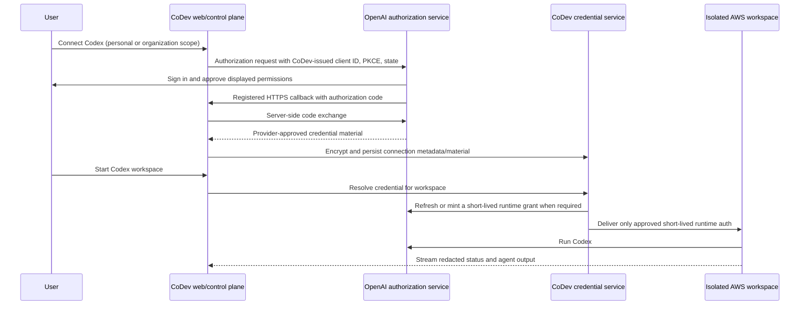

# hosted Codex subscription connection

## Goal

Let a CoDev user connect their own eligible Codex subscription without pasting
an API key. The connection is used only for that user's CoDev workspaces unless
an organization administrator deliberately configures an organization-scoped
connection.

The desired experience is:

1. In CoDev settings, choose **Connect Codex subscription**.
2. Complete an OpenAI-hosted consent screen that identifies CoDev, its requested
   permissions, and the selected scope.
3. Return to CoDev, where the connection appears as **Connected** with a
   redacted account label and a disconnect control.
4. Start a cloud workspace. CoDev supplies short-lived, provider-approved
   runtime authentication to that isolated workspace and runs Codex there.

## CoDev architecture

### 1. Browser and control plane

The browser starts a connection but never receives provider access tokens,
refresh tokens, authorization codes after the callback, client secrets, or
runtime credentials.

- Create a connection attempt with a random opaque ID, user ID, intended scope,
  allowed return path, PKCE verifier, state, and a ten-minute expiry.
- Store the attempt server-side or in a signed, `HttpOnly`, `Secure`,
  `SameSite=Lax` cookie. Bind it to the signed-in CoDev user and scope.
- Redirect only to an OpenAI-registered HTTPS authorization endpoint using the
  client ID and parameters supplied by OpenAI.
- On callback, validate state, user binding, expiry, redirect URI, issuer, and
  any provider-specified nonce before exchanging the code server-side.
- Return a redacted success/failure status to Settings. Never include token
  payloads in HTML, JSON responses, telemetry, logs, exception messages, or
  browser storage.

### 2. Credential service

Create a server-only provider credential service, separate from workspace and
web UI code. It owns encryption, refresh, revocation, and runtime delivery.

Suggested record shape:

| Field                                    | Purpose                                                                      |
| ---------------------------------------- | ---------------------------------------------------------------------------- |
| `id`                                     | Opaque credential identifier.                                                |
| `provider`                               | `openai`.                                                                    |
| `kind`                                   | `hosted_codex_subscription`; distinct from API-key and test-fixture records. |
| `scope_type`, `scope_id`                 | `USER` or `ORGANIZATION`, with the owning CoDev ID.                          |
| `provider_subject_hash`                  | HMAC of the provider account ID, for matching without exposing it.           |
| `encrypted_material`                     | Envelope-encrypted credential material or the OpenAI-approved equivalent.    |
| `key_version`                            | KMS/key-encryption-key version for rotation.                                 |
| `expires_at`, `last_refreshed_at`        | Lifecycle scheduling only; never expose exact token data.                    |
| `status`                                 | `active`, `reauthorization_required`, `revoked`, or `failed`.                |
| `created_by`, `created_at`, `revoked_at` | Accountability and audit.                                                    |

Use authenticated envelope encryption with a dedicated KMS key. Limit decrypt
permission to the credential service identity; neither Vercel request handlers,
workspace users, nor general operations identities may decrypt long-lived
material. Do not use `NEXT_PUBLIC_*` variables for any credential.

### 3. Scope and authorization

Personal credentials belong to one CoDev user and take priority for that
user's workspace. Organization credentials are shared defaults, configurable
only by organization administrators. The selected scope must be explicit at
consent time and in the Settings UI.

Recommended resolution order:

1. A valid personal Codex subscription connection for the workspace creator.
2. A valid organization Codex subscription connection, if the organization
   administrator has enabled sharing.
3. A separately configured, supported alternate provider method.
4. A clear "no usable credential" state; never silently select another user's
   personal connection.

Membership removal, organization removal, or loss of admin authorization must
immediately prevent new uses of the affected organization connection. A user
may disconnect their personal connection at any time; an admin may revoke an
organization connection.

### 4. AWS workspace runtime

CoDev's Vercel-hosted control services request a single-use runtime grant from
the credential service only after workspace authorization is checked. The
credential service must use the delivery mechanism OpenAI approves. Prefer a
short-lived, audience-bound runtime grant over a reusable refresh token.

- Create the Firecracker workspace with no provider credential in its image,
  repository, environment history, command arguments, or logs.
- Inject the approved runtime material at process start through a one-time
  in-memory secret channel or provider-approved file mechanism.
- Restrict filesystem permissions to the agent process. Disable shell history
  and redact runtime variables from diagnostic collection.
- Delete runtime material when the Codex process exits, the workspace stops,
  changes owner, hibernates, or transitions to another credential.
- On hibernation wake, re-resolve the credential and mint new runtime material;
  do not restore an old token snapshot.
- Never reuse a sandbox with an existing provider login. Before reassigning a
  workspace, erase any provider runtime state using the approved lifecycle
  procedure.

The infrastructure boundary remains unchanged: Vercel services are the
control plane, and AWS Firecracker workspaces are the execution plane.

### 5. Refresh, failure, and fallback

Serialize refreshes per credential record so concurrent workspaces cannot race
and overwrite a rotated token. Refresh proactively only as OpenAI permits.

| Provider result                         | CoDev behavior                                                                                                                                                 |
| --------------------------------------- | -------------------------------------------------------------------------------------------------------------------------------------------------------------- |
| Runtime grant near expiry               | Refresh/mint server-side; continue the active turn only if the provider approves replay.                                                                       |
| Refresh rejected or user revoked access | Mark only that credential `reauthorization_required`; stop new turns and preserve the transcript.                                                              |
| Usage limit/quota exhausted             | Mark the affected credential unavailable for the applicable window and move to the next approved credential only when the user/admin configured that fallback. |
| Other auth failure                      | Do one documented refresh/retry; then surface a redacted recovery message and do not loop.                                                                     |
| Disconnect                              | Revoke upstream first when supported, delete encrypted material, invalidate outstanding grants, stop new turns, and write an audit event.                      |

Do not replay a destructive agent action automatically merely because
authentication was refreshed. The workspace must retain its turn state and
make a replay decision according to the provider contract and CoDev's existing
turn safety rules.

## User experience

The Settings page should distinguish credential kinds and scopes:

| Row                             | State text                          | Controls                                           |
| ------------------------------- | ----------------------------------- | -------------------------------------------------- |
| Personal Codex subscription     | `Connected · <redacted account>`    | Reconnect, Disconnect                              |
| Organization Codex subscription | `Connected for this organization`   | Admin: Reconnect, Disconnect; members: status only |
| OpenAI API key                  | `Connected · ending XXXX`           | Replace, Revoke                                    |
| Test fixture                    | `Fixture only — no ChatGPT consent` | Test-only controls                                 |

Connection UI requirements:

- Explain whether the connection will power cloud workspaces and who can use
  it before sending the user to OpenAI.
- Link to CoDev's privacy notice, data retention policy, and disconnect flow.
- State when organization scope is selected and require an administrator
  confirmation before redirecting to consent.
- Show redacted account labels only. Do not show provider token expiry times,
  identifiers, or scopes unless OpenAI requires user-visible disclosure.
- Make reconnection and revocation available without a support request.

## Security controls and audit

1. Enforce per-user/organization authorization at connection, runtime grant,
   refresh, revocation, and workspace wake—not only in the UI.
2. Use least-privilege service identities: web callback may create a connection;
   only the credential service may decrypt/refresh; only a per-workspace
   workload identity may receive a short-lived runtime grant.
3. Audit connection created, scope changed, runtime grant minted, refresh,
   fallback, disconnect, and failed authorization events. Store IDs, actor,
   time, and result, but never token values or authorization codes.
4. Rate-limit connect, callback, refresh, and runtime-grant issuance. Bind
   grants to provider, credential, workspace, user/org scope, audience, and
   short expiry.
5. Monitor for unusual location, refresh, workspace, and failure patterns.
   Document on-call revocation and incident response before launch.
6. Encrypt backups and prohibit credential material from logs, analytics,
   error trackers, support exports, fixtures, and test snapshots.

## Verification plan

Automated tests must cover:

- state/PKCE validation, callback expiry, CSRF, open-redirect rejection, wrong
  user, wrong scope, and failed issuer/nonce validation;
- API-key, subscription-credential, and fixture isolation;
- personal-over-organization precedence; admin-only organization management;
  membership removal; and no cross-tenant lookup;
- encryption/decryption access boundaries and redacted public responses;
- serialized refresh, rotation persistence, revoked connection, expired grant,
  quota fallback, and no duplicate destructive action replay;
- no long-lived credential in workspace images, command arguments, environment
  dumps, hibernation snapshots, logs, or reused sandboxes; and
- end-to-end browser consent in an OpenAI-provided sandbox/test tenant,
  workspace launch, disconnect, and upstream revocation.

Before production, complete threat modeling, dependency review, secret scanning,
load testing of refresh serialization, and an approval-gated security review
with OpenAI and CoDev operations.

## Implementation sequence after approval

1. Record the OpenAI approval and integration contract in a private security
   record; register only the supplied redirect URIs and client configuration.
2. Replace CoDev's Codex public-CLI/default-client and device-flow assumptions
   with the approved configuration. Keep all provider constants server-only.
3. Add the credential type, scope checks, KMS envelope encryption, audit
   events, and revocation lifecycle in the existing provider credential layer.
4. Implement the approved callback and token/grant exchange behind a disabled
   server-side feature flag. No environment setting may enable it by accident.
5. Add workspace runtime-grant delivery and destruction to the AWS
   provisioning/wake/teardown paths.
6. Add the personal and organization Settings UI, clear consent copy, status,
   fallback configuration, and disconnect controls.
7. Run the verification plan in the OpenAI-approved test environment; obtain
   written security sign-off; then enable a limited, monitored beta.

## Existing CoDev code to change

`apps/web/lib/oauth.ts` and its related routes currently contain Codex
first-party-client/device-flow assumptions. They must **not** be used as the
foundation of this hosted integration. The production implementation should
instead be a new OpenAI-approved module with a narrow configuration surface.

The existing F6.5 provider-connection callback remains a test fixture. It must
stay visibly labelled as a fixture and never be upgraded by changing copy or
feature flags. API-key and fixture credentials must continue to have separate
lifecycles from `hosted_codex_subscription` records.